# Unified3D — Architecture

> **Headless 3D Asset Processing Framework**  
> Analyze, compare, transform, rig, animate, validate and convert 3D assets without requiring a DCC, viewport or renderer.

**Document version:** 0.2  
**Project:** Unified3D  
**Primary implementation target:** C++20 Core + native Runtime  
**Frontends:** TypeScript Workbench, Python/ComfyUI, CLI  
**Initial formats:** FBX, GLB/glTF  
**Future formats:** USD/USDZ and additional interchange formats

---

## 1. Project at a glance

Unified3D separates **3D data processing** from **3D visualization**.

```text
DCC workflow
────────────
Open application
→ Initialize UI
→ Initialize viewport
→ Load scene
→ Configure tools
→ Process asset
→ Export

Unified3D workflow
──────────────────
Load
→ Process
→ Validate
→ Save
```

The Core is designed to run:

- without a viewport;
- without a renderer;
- without a GPU;
- without a desktop session;
- locally from a CLI;
- inside a persistent native runtime;
- from a node graph;
- from Python or TypeScript;
- in batch processing environments.

---

# 2. Complete system architecture

```mermaid
flowchart TB

    subgraph FRONTENDS["Frontends / User Interfaces"]
        WB["Workbench<br/>TypeScript Node Graph"]
        CUI["ComfyUI<br/>Python Nodes"]
        CLI["Unified3D CLI"]
        AI["AI Planner / Agent<br/>Optional"]
        VIEWER["3D Viewer / Preview<br/>Optional"]
    end

    subgraph CLIENTS["Client SDK Layer"]
        TS["@unified3d/client<br/>TypeScript SDK"]
        PY["Unified3D Python Client"]
        CLISDK["CLI Client"]
    end

    subgraph TRANSPORT["Local Communication Layer"]
        RPC["JSON-RPC 2.0<br/>Control Plane"]
        IPC["IPC Transport"]
        PIPE["Windows Named Pipe"]
        UDS["Unix Domain Socket"]
        SHM["Shared Memory / Binary Stream<br/>Future Data Plane"]
    end

    subgraph RUNTIME["unified3d-runtime"]
        GATEWAY["RPC Gateway"]
        SESSION["Session Manager"]
        REGISTRY["Asset / Object Registry"]
        HANDLES["Handle Manager"]
        DISPATCH["Operation Dispatcher"]
        SCHEDULER["Operation Scheduler"]
        CACHE["Analysis / Asset Cache"]
        RESOLVER["Resource Resolver"]
        SECURITY["Resource & Security Policy"]
        PROGRESS["Progress / Cancellation"]
        LOG["Diagnostics / Logging"]
    end

    subgraph OPERATIONS["Unified3D Operations"]
        ANALYSIS["Analysis"]
        COMPARE["Comparison"]
        GEOMETRY["Geometry Processing"]
        MATERIALS["Materials / Textures"]
        RIGGING["Rigging / Skeleton"]
        SKINNING["Skinning / Weight Transfer"]
        ANIMATION["Animation"]
        CONVERSION["Conversion"]
        OPTIMIZATION["Optimization"]
        VALIDATION["Validation"]
        SERIALIZATION["Serialization"]
    end

    subgraph CORE["Unified3D C++20 Core"]
        OBJECT["Object Model"]
        MATH["Math"]
        RESOURCE["Resources"]
        SCENE["Scene Graph"]
        GEOCORE["Geometry"]
        MATCORE["Materials"]
        RIGCORE["Rigging"]
        ANIMCORE["Animation"]
        MORPH["Morph Targets"]
        DIAG["Diagnostics"]
    end

    subgraph ADAPTERS["Format Adapter Layer"]
        FBX_A["FBX Autodesk Adapter"]
        FBX_U["FBX ufbx Adapter"]
        GLTF["glTF / GLB Adapter"]
        USD["USD / USDZ Adapter<br/>Future"]
        OTHER["Other Formats<br/>Future"]
    end

    subgraph NATIVE["External / Native Libraries"]
        AUTODESK["Autodesk FBX SDK<br/>Optional / External"]
        UFBX["ufbx<br/>Open Source"]
        GLTFLIB["glTF Backend<br/>glTF-Transform MVP<br/>Native C++ Later"]
        USDLIB["OpenUSD / USD Backend<br/>Future"]
    end

    subgraph FILES["3D Assets"]
        FBXFILE[".fbx"]
        GLBFILE[".glb / .gltf"]
        USDFILE[".usd / .usdz"]
        TEX["Textures / External Resources"]
    end

    WB --> TS
    CUI --> PY
    CLI --> CLISDK
    AI --> TS

    TS --> RPC
    PY --> RPC
    CLISDK --> RPC

    RPC --> IPC
    IPC --> PIPE
    IPC --> UDS
    RPC -. large payload metadata .-> SHM

    PIPE --> GATEWAY
    UDS --> GATEWAY
    SHM -. future .-> GATEWAY

    GATEWAY --> SESSION
    GATEWAY --> DISPATCH
    SESSION --> HANDLES
    HANDLES --> REGISTRY
    DISPATCH --> SCHEDULER

    SCHEDULER --> ANALYSIS
    SCHEDULER --> COMPARE
    SCHEDULER --> GEOMETRY
    SCHEDULER --> MATERIALS
    SCHEDULER --> RIGGING
    SCHEDULER --> SKINNING
    SCHEDULER --> ANIMATION
    SCHEDULER --> CONVERSION
    SCHEDULER --> OPTIMIZATION
    SCHEDULER --> VALIDATION
    SCHEDULER --> SERIALIZATION

    SCHEDULER --> CACHE
    SCHEDULER --> RESOLVER
    SCHEDULER --> PROGRESS
    SCHEDULER --> LOG
    RESOLVER --> SECURITY

    ANALYSIS --> CORE
    COMPARE --> CORE
    GEOMETRY --> CORE
    MATERIALS --> CORE
    RIGGING --> CORE
    SKINNING --> CORE
    ANIMATION --> CORE
    CONVERSION --> CORE
    OPTIMIZATION --> CORE
    VALIDATION --> CORE
    SERIALIZATION --> CORE

    OBJECT --- MATH
    OBJECT --- RESOURCE
    OBJECT --- SCENE
    SCENE --- GEOCORE
    GEOCORE --- MATCORE
    GEOCORE --- RIGCORE
    RIGCORE --- ANIMCORE
    GEOCORE --- MORPH
    CORE --- DIAG

    CORE --> FBX_A
    CORE --> FBX_U
    CORE --> GLTF
    CORE --> USD
    CORE --> OTHER

    FBX_A --> AUTODESK
    FBX_U --> UFBX
    GLTF --> GLTFLIB
    USD --> USDLIB

    AUTODESK --> FBXFILE
    UFBX --> FBXFILE
    GLTFLIB --> GLBFILE
    USDLIB --> USDFILE

    RESOLVER --> TEX

    REGISTRY -. preview handle .-> VIEWER
```

---

# 3. Architectural layers

| Layer | Responsibility | Must not depend on |
|---|---|---|
| **Frontends** | UI, node graph, user interaction | Format SDK internals |
| **Client SDKs** | Typed API exposed to TypeScript/Python | Heavy 3D buffers |
| **RPC / IPC** | Communication between processes | 3D algorithms |
| **Runtime** | Asset ownership, scheduling, caching, sessions | UI framework |
| **Operations** | Deterministic processing functions | ComfyUI/Workbench |
| **Core** | Unified multi-format 3D object model | Renderer |
| **Adapters** | Native format translation | Frontend |
| **Native Libraries** | FBX/glTF/USD implementation details | Unified3D UI |
| **Viewer** | Optional visual inspection | Core processing path |

---

# 4. Core design rule

## Operation is not a Node

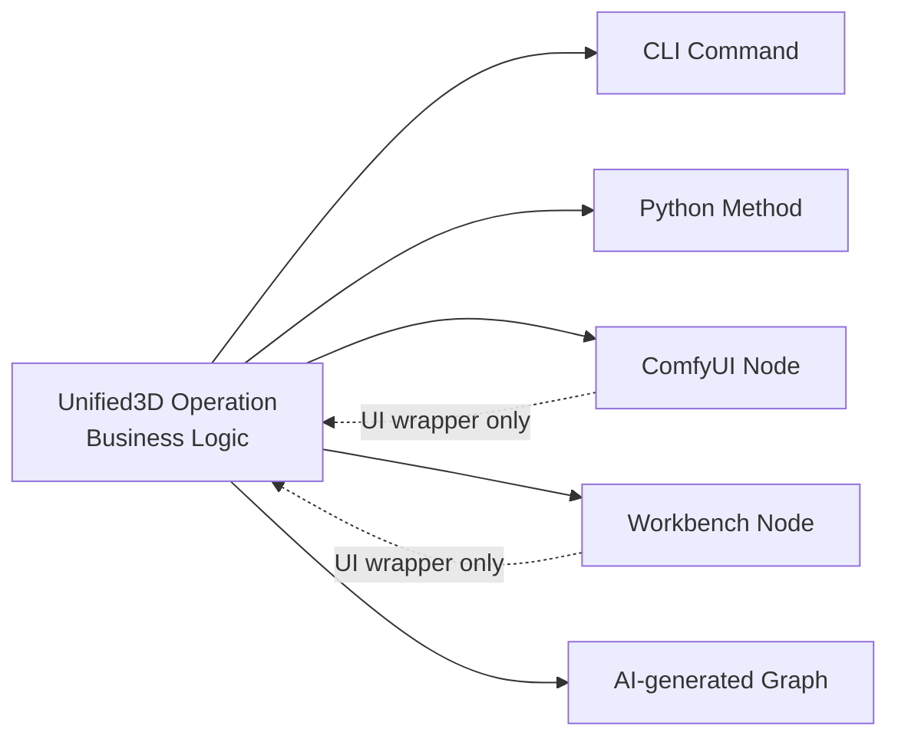

A node is a **frontend representation** of an operation.

The processing algorithm must not be duplicated inside:

- ComfyUI Python code;
- Workbench TypeScript code;
- CLI command code.

---

# 5. Persistent Runtime

The Workbench does not load Autodesk FBX SDK, ufbx or the full geometry directly.

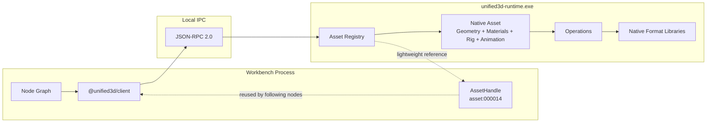

### Why a separate process?

It isolates:

```text
Workbench UI
from
native parsers
SDK crashes
large memory allocations
long computations
third-party native dependencies
```

If the Runtime crashes:

```text
Workbench remains alive
→ Restart Runtime
→ Reconnect
→ Reload assets
```

---

# 6. RPC and IPC

```text
RPC = how a function is requested
IPC = how the request travels between local processes
```

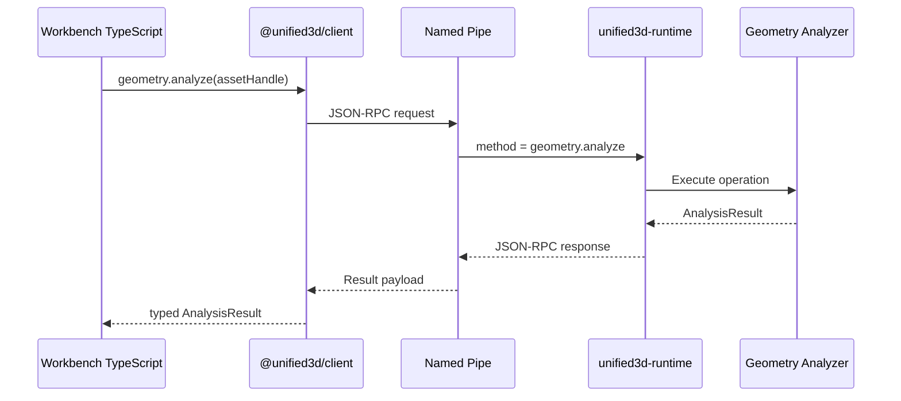

### Initial transport

```text
Windows
\\.\pipe\Unified3D.Runtime.v1

Linux / macOS
Unix Domain Socket
```

### Future large-data transport

```text
RPC = control plane
Shared Memory = data plane
```

Large vertex buffers and textures must not be serialized into JSON.

---

# 7. Handle architecture

Frontend sockets carry lightweight references.

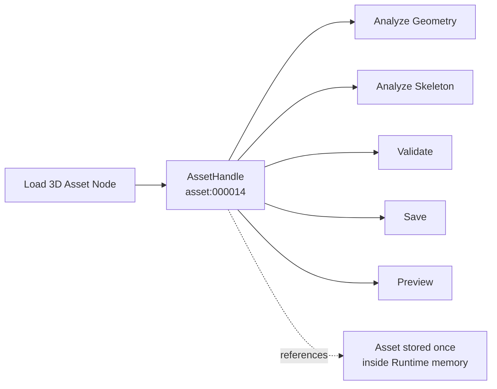

Canonical handle types:

```text
AssetHandle
SceneHandle
NodeHandle
MeshHandle
PrimitiveHandle
MaterialHandle
TextureHandle
SkeletonHandle
SkinHandle
AnimationHandle
AnalysisHandle
ComparisonHandle
ValidationHandle
OperationHandle
```

---

# 8. Canonical Workbench socket types

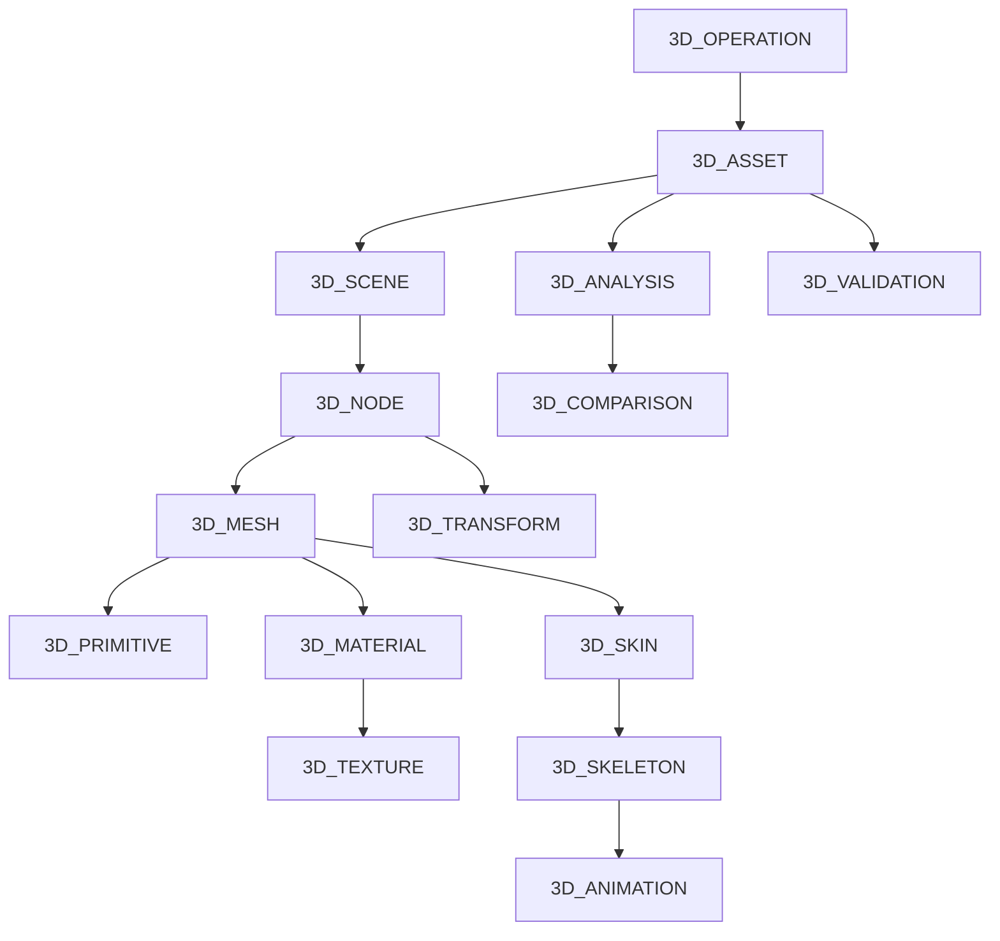

Most sockets transport handles rather than raw buffers.

---

# 9. Unified3D Core Object Model

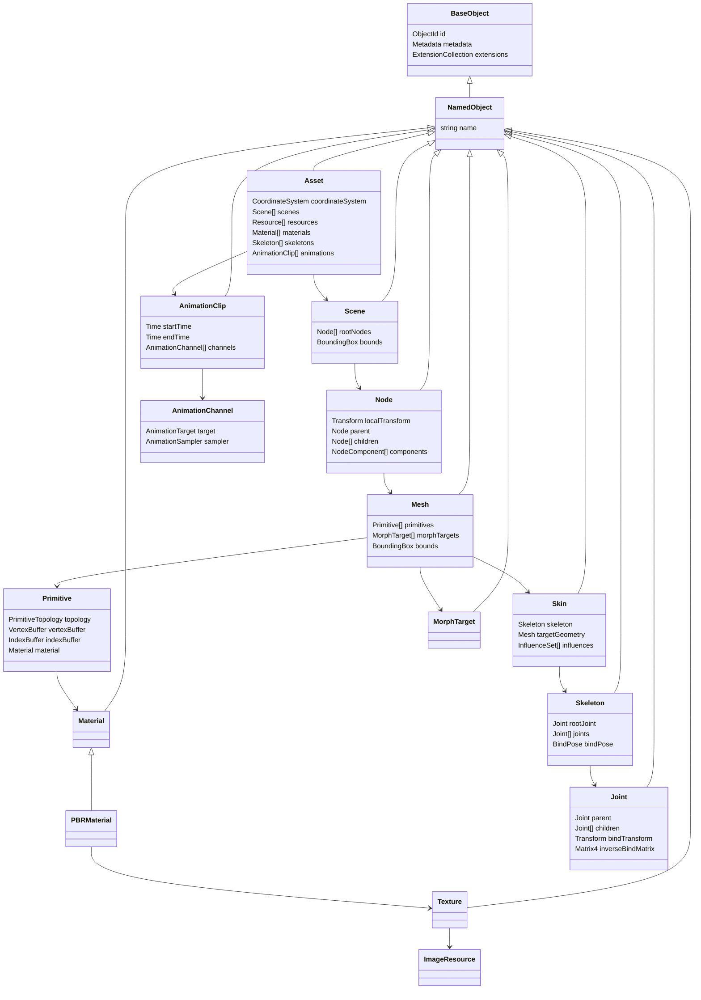

This model is **not an Autodesk FBX SDK clone**.

It represents only the common semantics needed by Unified3D.

---

# 10. Native format preservation

Not every FBX, glTF or USD concept should be forced into a common abstraction.

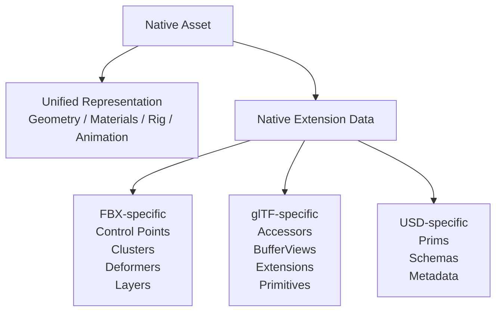

Rule:

> **Normalize what is semantically common. Preserve what is format-specific.**

---

# 11. Format adapter architecture

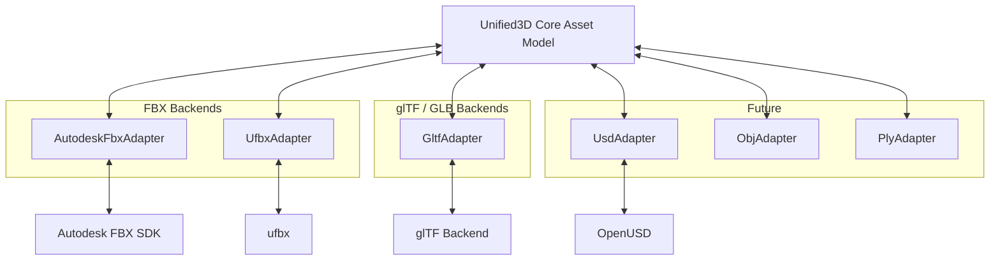

---

# 12. Autodesk backend boundary

The public repository contains:

```text
Unified3D adapter code
build detection
CMake integration
runtime interface
documentation
```

It does **not** contain:

```text
Autodesk source code
fbxsdk.h
Autodesk .lib
Autodesk .dll
```

The official Autodesk FBX SDK is an optional, separately installed backend.

---

# 13. FBX backend cross-validation

Unified3D can use two FBX implementations.

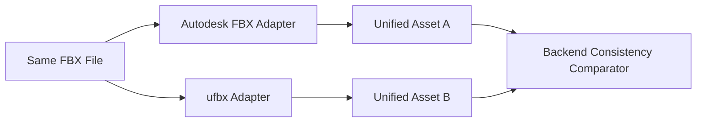

This allows the open-source backend to be empirically compared against the official Autodesk interpretation.

---

# 14. Geometry representation

A critical distinction is maintained between:

```text
Geometric Vertex
and
Render Vertex
```

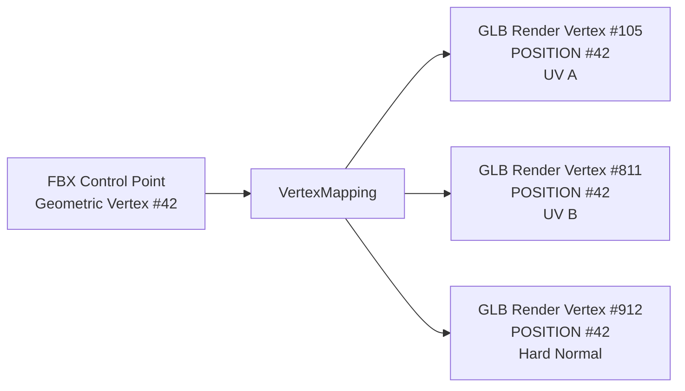

This is required because UV seams, hard normals or material boundaries can duplicate runtime vertices without changing the underlying surface.

---

# 15. Geometry comparison pipeline

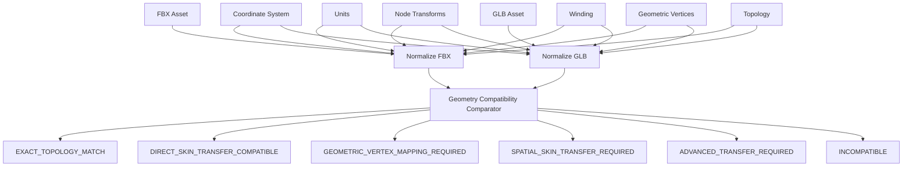

---

# 16. Geometry comparison levels

```text
Level 0  File / Asset validity
Level 1  Coordinate system and units
Level 2  Bounding boxes and dimensions
Level 3  Mesh / primitive structure
Level 4  Triangle statistics
Level 5  Geometric and render vertex statistics
Level 6  Topology signatures
Level 7  Spatial geometry matching
Level 8  Skeleton compatibility
Level 9  Skin-transfer strategy
```

Outputs include:

```text
compatibility_class
compatibility_score
recommended_transfer_method
diagnostics
```

---

# 17. Skin transfer architecture

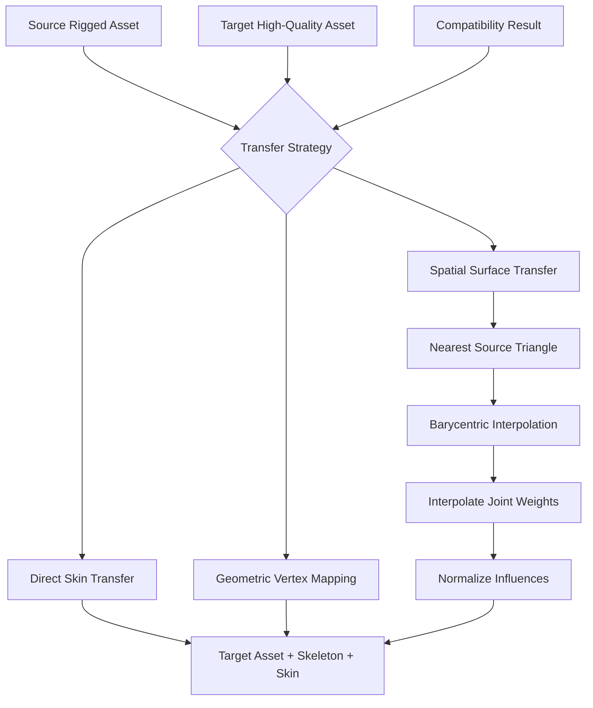

---

# 18. Skeleton compatibility

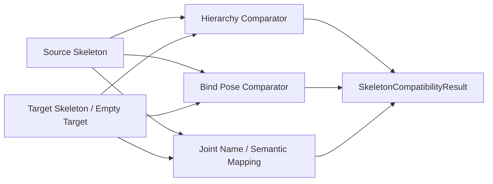

Signatures:

```text
HierarchySignature
BindPoseSignature
SemanticSkeletonSignature
```

---

# 19. Animation architecture

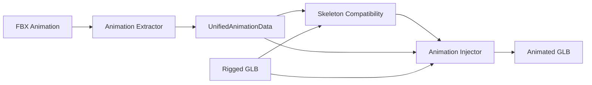

Common animation model:

```text
AnimationClip
├── AnimationChannel
│   ├── Target
│   └── AnimationSampler
│       ├── Times
│       ├── Values
│       └── Interpolation
```

---

# 20. Founding workflow

The initial proof of value for Unified3D:

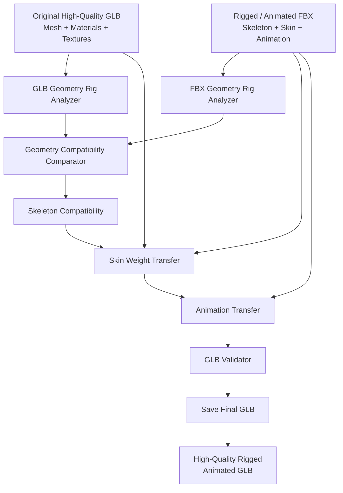

Objective:

```text
Preserve:
✓ original mesh
✓ original materials
✓ original textures

Transfer:
✓ skeleton
✓ skin weights
✓ animations
```

---

# 21. Existing FBX analysis reference

Current real analysis fixture:

```text
FBX Version                : 7.7.0
Meshes                     : 10
Control Points             : 27,311
Polygon Vertices           : 150,177
Polygons                   : 50,059
Triangles                  : 50,059
UV Sets                    : 10
Materials                  : 1
Skeleton Bones             : 41
Skins                      : 10
Clusters                   : 75
Max Influences / CP        : 6
Animations                 : 1
Topology Signature         : fd17e9faa2426bc8
```

This fixture is one of the first integration references for:

```text
FBX Analyzer
→ GLB Analyzer
→ Comparator
```

---

# 22. Operation execution model

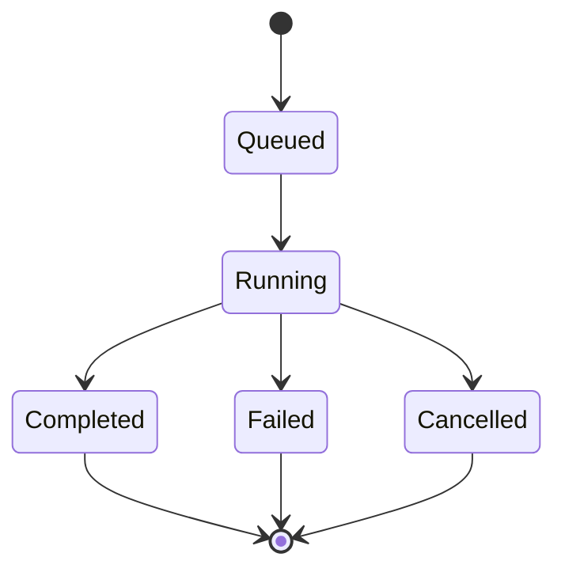

Long operations return an `OperationHandle`.

Example:

```text
operation:000291
```

Progress event:

```json
{
  "operation": "operation:000291",
  "progress": 0.46,
  "phase": "Spatial Vertex Mapping"
}
```

---

# 23. Runtime scheduling

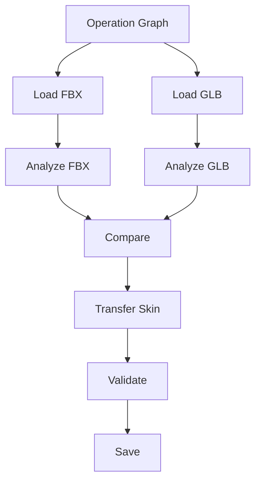

Parallelizable stage:

```text
Analyze FBX
||
Analyze GLB
```

The scheduler is responsible for:

- dependency resolution;
- parallel execution;
- cache reuse;
- cancellation;
- progress aggregation;
- failure propagation.

---

# 24. Cache architecture

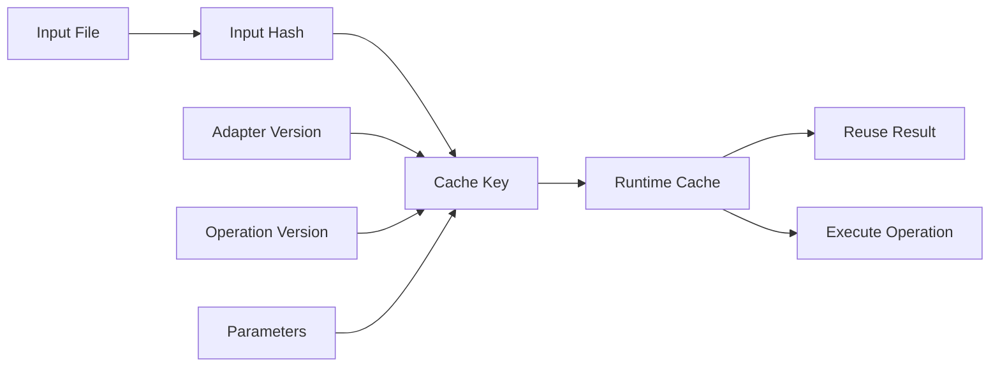

A geometry analysis should not be recomputed when:

```text
file unchanged
+
adapter unchanged
+
operation unchanged
+
parameters unchanged
```

---

# 25. Resource security model

3D files are treated as potentially untrusted input.

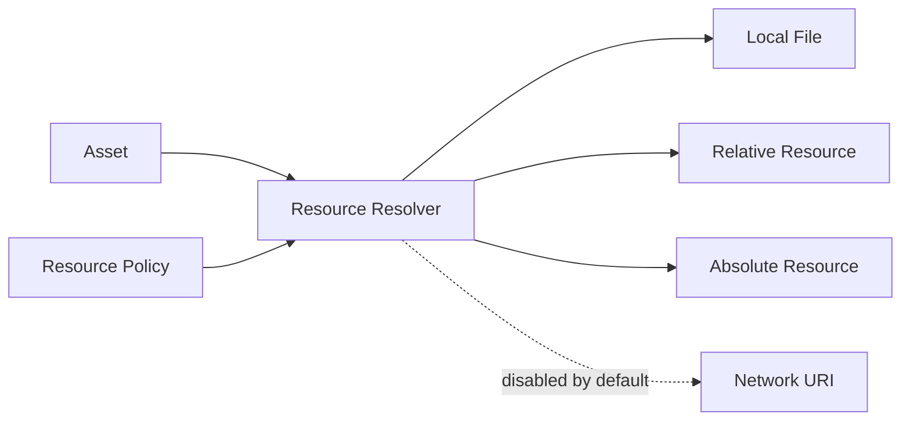

Checks include:

```text
buffer bounds
maximum allocation
maximum recursion depth
file size limits
path normalization
external URI policy
malformed file detection
```

---

# 26. Viewer is optional

```mermaid
flowchart LR

    CORE["Unified3D Core"]

    PROC["Analyze / Compare / Convert / Rig / Animate"]
    VIEW["Optional Viewer"]

    THREE["Three.js"]
    BABYLON["Babylon.js"]
    D3D["Direct3D"]
    WEBGPU["WebGPU"]

    CORE --> PROC

    CORE -. optional .-> VIEW

    VIEW --> THREE
    VIEW --> BABYLON
    VIEW --> D3D
    VIEW --> WEBGPU
```

No processing operation should require the viewer.

---

# 27. Frontend portability

```mermaid
flowchart TB

    OP["GeometryCompatibilityComparator Operation"]

    COMFY["ComfyUI Wrapper<br/>Python"]
    WORK["Workbench Wrapper<br/>TypeScript"]
    CLI["CLI Wrapper"]
    PY["Python SDK"]
    AI["AI Planner"]

    COMFY --> OP
    WORK --> OP
    CLI --> OP
    PY --> OP
    AI --> OP
```

This is the basis for migrating the existing custom ComfyUI node library into the Workbench later without rewriting the algorithms.

---

# 28. AI-assisted architecture

AI is allowed to **plan**, not silently replace deterministic processing.

```mermaid
flowchart LR

    USER["User Intent"]
    AI["AI Planner"]
    GRAPH["Validated Operation Graph"]
    RT["Unified3D Runtime"]
    OPS["Deterministic Operations"]
    RESULT["3D Asset / Report"]

    USER --> AI
    AI --> GRAPH
    GRAPH --> RT
    RT --> OPS
    OPS --> RESULT
```

Examples of AI assistance:

```text
workflow generation
parameter suggestions
diagnostic explanation
transfer strategy recommendation
asset classification
automatic routing
```

---

# 29. Repository architecture

```text
Unified3D/
│
├── README.md
├── LICENSE
├── CONTRIBUTING.md
├── SECURITY.md
│
├── docs/
│   ├── architecture/
│   │   └── ARCHITECTURE.md
│   ├── specifications/
│   ├── protocols/
│   ├── formats/
│   └── operations/
│
├── core/
│   ├── object/
│   ├── math/
│   ├── resources/
│   ├── scene/
│   ├── geometry/
│   ├── materials/
│   ├── rigging/
│   ├── animation/
│   └── diagnostics/
│
├── adapters/
│   ├── fbx-autodesk/
│   ├── fbx-ufbx/
│   ├── gltf/
│   └── usd/
│
├── operations/
│   ├── analysis/
│   ├── comparison/
│   ├── geometry/
│   ├── materials/
│   ├── rigging/
│   ├── skinning/
│   ├── animation/
│   ├── conversion/
│   ├── optimization/
│   └── validation/
│
├── runtime/
│   ├── registry/
│   ├── scheduler/
│   ├── cache/
│   ├── gateway/
│   ├── transport/
│   └── security/
│
├── sdk/
│   ├── cpp/
│   ├── python/
│   └── typescript/
│
├── frontends/
│   ├── cli/
│   ├── comfyui/
│   └── workbench/
│
├── tests/
│   ├── unit/
│   ├── integration/
│   ├── regression/
│   └── assets/
│
└── tools/
```

---

# 30. Runtime API groups

Initial RPC namespaces:

```text
runtime.*
session.*

asset.*
resource.*

geometry.*
material.*
skeleton.*
skin.*
animation.*

validation.*
conversion.*

operation.*
cache.*
```

Example calls:

```text
runtime.hello
asset.load
asset.save
asset.release

geometry.analyze
geometry.compare

skeleton.analyze
skeleton.compare

skin.transfer

animation.extract
animation.inject

validation.validate

operation.status
operation.cancel
```

---

# 31. Minimal TypeScript usage

```typescript
const client = await Unified3DClient.connect();

const original = await client.asset.load(
    "character-original.glb"
);

const rigged = await client.asset.load(
    "character-rigged.fbx"
);

const comparison = await client.geometry.compare(
    rigged,
    original
);

const finalAsset = await client.skin.transfer({
    source: rigged,
    target: original,
    method: comparison.recommendedMethod
});

await client.asset.save(
    finalAsset,
    "character-final.glb"
);
```

The API is operation-oriented.

The Workbench does not need to mirror hundreds of C++ classes.

---

# 32. Development roadmap

```mermaid
flowchart LR

    P1["Phase 1<br/>Analysis"]
    P2["Phase 2<br/>Comparison"]
    P3["Phase 3<br/>Skin Transfer"]
    P4["Phase 4<br/>Animation"]
    P5["Phase 5<br/>Runtime + IPC"]
    P6["Phase 6<br/>Workbench"]
    P7["Phase 7<br/>Additional Formats"]

    P1 --> P2
    P2 --> P3
    P3 --> P4
    P4 --> P5
    P5 --> P6
    P6 --> P7
```

### Phase 1

```text
FBX Geometry Rig Analyzer
GLB Geometry Rig Analyzer
Unified Analysis Schema
```

### Phase 2

```text
Geometry Compatibility Comparator
Skeleton Comparator
```

### Phase 3

```text
Vertex Mapping
Skin Weight Transfer
GLB Skin Writer
```

### Phase 4

```text
Unified Animation Schema
Animation Extract
Animation Inject
```

### Phase 5

```text
unified3d-runtime
JSON-RPC 2.0
Named Pipe / Unix Socket
Asset Registry
Handle Model
```

### Phase 6

```text
@unified3d/client
Workbench Node Wrappers
Canonical 3D Socket Types
```

### Phase 7

```text
USD / USDZ
Additional geometry formats
Optional remote/distributed runtime
```

---

# 33. Initial success criteria

The architecture is validated when the project can perform:

```text
Original GLB
+
Rigged / Animated FBX
↓
Unified3D
↓
Final Rigged / Animated GLB
```

while preserving:

```text
✓ original geometry
✓ original materials
✓ original textures
```

and transferring:

```text
✓ skeleton
✓ skin weights
✓ animations
```

without requiring:

```text
✗ Blender
✗ Maya
✗ 3ds Max
✗ interactive viewport
✗ renderer initialization
```

---

# 34. Long-term vision

Unified3D should become a reusable **3D processing infrastructure**, not just a converter.

```text
                          Unified3D
                              │
            ┌─────────────────┼─────────────────┐
            │                 │                 │
         Humans             Scripts            AI
            │                 │                 │
            ▼                 ▼                 ▼
        Workbench            CLI          AI Planner
            │                 │                 │
            └─────────────────┼─────────────────┘
                              ▼
                    Unified3D Runtime
                              │
                              ▼
                    Deterministic Core
                              │
          ┌───────────────────┼───────────────────┐
          ▼                   ▼                   ▼
         FBX                 glTF                USD
```

The central idea remains:

> **Do not open a complete 3D application when the requested operation is fundamentally a deterministic transformation of 3D data.**

---

## Related documents

Recommended repository documentation structure:

```text
README.md
docs/
├── architecture/
│   └── ARCHITECTURE.md
├── specifications/
│   ├── Unified3D_Implementation_Specification_v0.1.0.md
│   └── Unified3D_Implementation_Specification_v0.2.0.md
├── protocols/
│   └── RPC_PROTOCOL.md
└── operations/
    └── OPERATIONS.md
```
